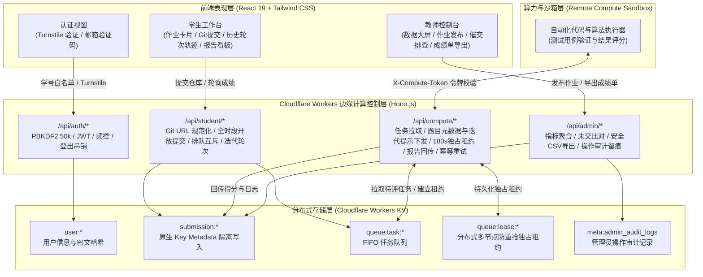

# 通用作业自动批改系统 (CPHomework)

> **课程教学与自动化评测系统**  
> 基于 Cloudflare Workers 的代码作业自动批改与管理系统

[](https://workers.cloudflare.com/)
[](https://hono.dev/)
[](https://react.dev/)
[](https://www.typescriptlang.org/)
[](https://vitejs.dev/)
[](#自动化测试验证)

---

## 项目简介

**CPHomework** 是基于 Cloudflare 边缘计算打造的**通用作业自动代码评测、算法验证与教学管理系统**。

系统采用 **Cloudflare Serverless (Workers + KV) 边缘计算架构**：
- **学生端**：通过学号与绑定的学生邮箱激活，提交 Git 代码仓库地址（支持分支与子目录），**全时段开放自由提交（不设截止时间限制）**，查阅自动化测试报告与综合得分，支持多轮迭代修复以渐进提高分数；
- **教学管理端**：查看选课激活率、作业完成度与队列负荷，排查未交学号（支持格式化复制催交），导出带有**防公式注入**与 **UTF-8 BOM** 编码的标准 CSV 成绩单；
- **计算层沙箱**：通过具备独占租约与幂等校验的接口安全拉取学生代码，**自动获取作业题目详情与先前各轮评测反馈（historyPrompt）**，并在隔离环境中运行代码测试与算法验证。

---

## 架构拓扑与数据流转



---

## 核心功能与安全设计

系统针对鉴权安全、数据一致性、通信协议及操作审计进行了系统加固：

### 1. 鉴权与密码学安全
- **PBKDF2 50,000 次哈希**：兼顾防暴力破解强度与边缘执行耗时（约 12ms）；
- **学号白名单过滤**：选课白名单（`src/config/whitelist.ts`）外的学号在前置校验即被拦截；
- **10 分钟邮件发送冷却**：防止短时间内高频调用邮件服务；
- **IP 复合限频**：针对校园网络共用 NAT 出口，采用 `IP + 学号` 复合限频策略；
- **会话失效机制**：支持登出与改密后自动自增 `tokenVersion`，使旧 JWT 失效。

### 2. 分布式 KV 存储与并发控制
- **原生 Key Metadata 存储**：单次提交独立写单键，避免大字典并发写冲突；
- **多计算节点独占租约 (Task Lease)**：拉取任务时原子写入 180s 独占租约（`queue:lease:${taskId}`），避免重复出队；
- **已删除键自动跳过**：出队时过滤尚未完成副本清理的已删除键；
- **超时任务恢复与异常熔断**：任务超时 5 分钟自动重入队一次；若连续执行崩溃则自动熔断给出 0 分与错误原因，并释放学生提交互斥锁。

### 3. 计算通信协议与 Git 安全
- **Git URL 规范化**：解析并去除多余路径，阻断以减号 `-` 开头的分支名与 `..` 路径穿越；
- **网络重试幂等放行**：相同任务重复回传相同成绩返回 `200 OK` 且附带 `idempotent: true`；禁止篡改已评分任务。

### 4. 全时段开放提交与多轮迭代评分
- **取消截止时间限制**：全天候保持开放提交状态，鼓励自主改进代码；
- **多轮提交历史记录**：记录历次评测得分、反馈日志与时间戳；
- **迭代改进提示词 (`historyPrompt`)**：将前序各轮次评语自动整理为提示词，供计算层 Agent 对比 diff 并参考前次不足评估改进；
- **题目元数据同步**：拉取任务时下发完整作业要求（标题、简介、详细说明），供自动化评测生成测试用例。

### 5. 教学管理数据保护
- **CSV 公式注入防御 (CSV Injection / DDE Neutralization)**：对以 `=`, `+`, `-`, `@`, `\t`, `\r` 开头的单元格数据自动前置 `'` 单引号，并在文件头注入 **UTF-8 BOM (`\uFEFF`)**，保障 Windows Excel 双击直接打开不乱码、不弹安全警告；
- **管理员操作审计留痕**：发布作业、删除作业、更改仓库白名单均写入环形审计日志（`meta:admin_audit_logs`）；
- **动态 HSTS 保护**：仅在非 `localhost` 的线上环境注入 `Strict-Transport-Security`，杜绝本地调试导致开发者浏览器被锁定 1 年。

---

## 项目工程目录

```
cphomework/
├── .dev.vars.example                # 本地开发机密变量模板 (严禁提交真实 .dev.vars)
├── .gitignore                       # Git 忽略配置
├── README.md                        # 项目主文档与架构技术说明
├── USAGE.md                         # 学生、教师与计算层全流程使用操作手册
├── package.json                     # 依赖声明与编译脚本
├── tsconfig.json                    # TypeScript 严格类型配置
├── vite.config.ts                   # 前端 Vite 打包与开发代理配置
├── wrangler.jsonc                   # Cloudflare Workers & KV 部署配置文件
├── src/
│   ├── index.ts                     # Worker 总入口：安全标头、CORS、Hono 路由注册与全局错误处理
│   ├── config/
│   │   └── whitelist.ts             # 选课学生学号白名单
│   ├── server/
│   │   ├── types.ts                 # 全局数据模型 (User, Assignment, Submission, TaskLease 等)
│   │   ├── auth.ts                  # PBKDF2哈希、常量时间比对、JWT签发、Turnstile人机核验
│   │   ├── kv.ts                    # KV 原生存储、原子元数据、任务租赁与队列流转核心逻辑
│   │   └── routes/
│   │       ├── auth.routes.ts       # 发送验证码、注册/重置、统一登录、注销登出
│   │       ├── student.routes.ts    # 作业列表、Git仓库校验、开放多轮提交、任务推入队列
│   │       ├── compute.routes.ts    # 任务认领租赁、题目元数据与迭代提示下发、报告回传、幂等处理
│   │       └── admin.routes.ts      # 监控大屏、作业CRUD、未交精准排查、安全CSV导出、审计日志
│   └── client/
│       ├── index.html               # 前端入口 (集成 Cloudflare Turnstile 脚本)
│       ├── main.tsx                 # React 19 应用挂载入口
│       ├── App.tsx                  # 顶层状态机、全局鉴权验证与 401 统一拦截路由
│       ├── styles.css               # 样式与排版规范
│       ├── components/
│       │   ├── TurnstileWidget.tsx  # Turnstile 验证组件 (支持超时重试与测试模式)
│       │   └── PasswordModal.tsx    # 统一改密弹窗
│       ├── utils/
│       │   └── clipboard.ts         # 剪贴板工具
│       └── views/
│           ├── AuthView.tsx         # 登录 / 注册 / 找回密码视图
│           ├── StudentView.tsx      # 学生端每周作业看板、评测状态展示与日志终端
│           └── AdminView.tsx        # 教师控制台 (指标大屏、作业管理、未交排查、CSV导出)
└── scripts/
    ├── test-system.ts               # 63 项安全与并发架构回归测试集
    └── mock-compute-runner.ts       # 计算层模拟评测 Worker (串行拉取、算法验证与成绩回传)
```

---

## 快速开始与本地开发

### 1. 环境准备
- Node.js 20+
- pnpm (推荐: `npm install -g pnpm`)

### 2. 安装依赖
```bash
pnpm install
```

### 3. 配置本地开发机密
复制环境变量模板：
```bash
cp .dev.vars.example .dev.vars
```
本地开发时保持默认测试配置即可：
- `JWT_SECRET`: 本地测试私钥；
- `COMPUTE_AUTH_TOKEN`: 计算层预置令牌 `whu-cphomework-compute-secret-key-2026`；
- `DEV_MOCK_EMAIL=true`: 本地无需真实发信，验证码会直接输出在服务端终端并在界面提示。

### 4. 运行全量自动化测试 (63 / 63 PASS)
```bash
npx tsx scripts/test-system.ts
```
全量测试覆盖了：健康检查、限频防刷、学号白名单校验、10分钟邮件冷却、防暴力破解、Git注入拦截、无截止时间全时段开放提交与迭代元数据校验、多节点任务独占租赁、幂等重试、安全CSV导出与公式中和、登出失效等 63 项断言。

### 5. 编译前端并启动本地 Serverless 服务
```bash
# 1. 编译前端单页应用生产包
pnpm run build

# 2. 启动 Cloudflare Workers 本地环境 (默认端口 8787)
pnpm run worker:dev
```
在浏览器中打开：[http://localhost:8787](http://localhost:8787)。

### 6. 启动计算层模拟评测沙箱
在另一个终端窗口启动计算节点 Worker：
```bash
pnpm run runner
```
计算节点将以心跳方式轮询控制层。当学生在网页提交作业后，计算节点将认领任务、打印评测日志并回传最终得分。

---

## 默认演示账户与凭据

| 角色 | 账号 / 学号 | 默认初始密码 | 说明 |
| :--- | :--- | :--- | :--- |
| **管理员 / 教师** | `admin` | `123456` | 首次登录后系统会提示修改密码 |
| **选课学生示例 1** | `2023302020001` | 注册时自定 | 白名单范围：`2023302020001` ~ `2023302020040` |
| **选课学生示例 2** | `2023302020002` | 注册时自定 | 验证码将发送至选课邮箱（开发模式终端可见） |
| **计算层沙箱通信令牌** | - | `whu-cphomework-compute-secret-key-2026` | 需在计算节点的请求头中携带 `X-Compute-Token` 或 `Bearer Token` |

---

## Cloudflare 生产环境部署

详细的云端部署步骤、生产域名绑定、KV 命名空间创建与密钥配置，请查阅配套的 **[《详细使用与运维指南 (USAGE.md)》](file:///d:/Users/megan/Documents/Serverless/cphomework/USAGE.md)**。

简要部署命令：
```bash
# 1. 创建生产 KV 命名空间
npx wrangler kv namespace create CPHW_KV

# 2. 将返回的 KV ID 写入 wrangler.jsonc 中的 kv_namespaces[0].id

# 3. 设置生产环境敏感机密 (通过 Cloudflare 加密存储，不存入任何代码库)
npx wrangler secret put JWT_SECRET
npx wrangler secret put COMPUTE_AUTH_TOKEN
npx wrangler secret put TURNSTILE_SECRET_KEY
npx wrangler secret put RESEND_API_KEY

# 4. 构建前端并发布至 Cloudflare 边缘网络
pnpm run deploy
```

---

## 使用手册索引

请阅读 **[USAGE.md](file:///d:/Users/megan/Documents/Serverless/cphomework/USAGE.md)** 获取以下角色的操作指南：
- **第一部分：学生操作全流程**（账号激活、人机验证、提交 Git 分支与子目录、查阅自动化评测日志）；
- **第二部分：教师与助教管理指南**（修改弱密码、发布作业、未交学号精准催交、导出防注入 CSV 成绩单）；
- **第三部分：计算节点与评测沙箱接入指南**（任务租赁通信协议、断网重发幂等性、Docker 沙箱编写范例）；
- **第四部分：Cloudflare 生产运维与安全加固指南**（WAF 防御规则、邮件网关配置、密钥轮换）。
